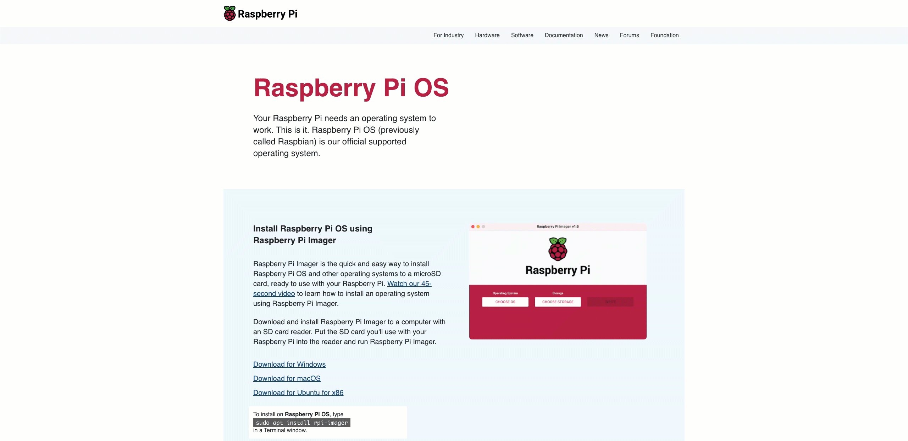
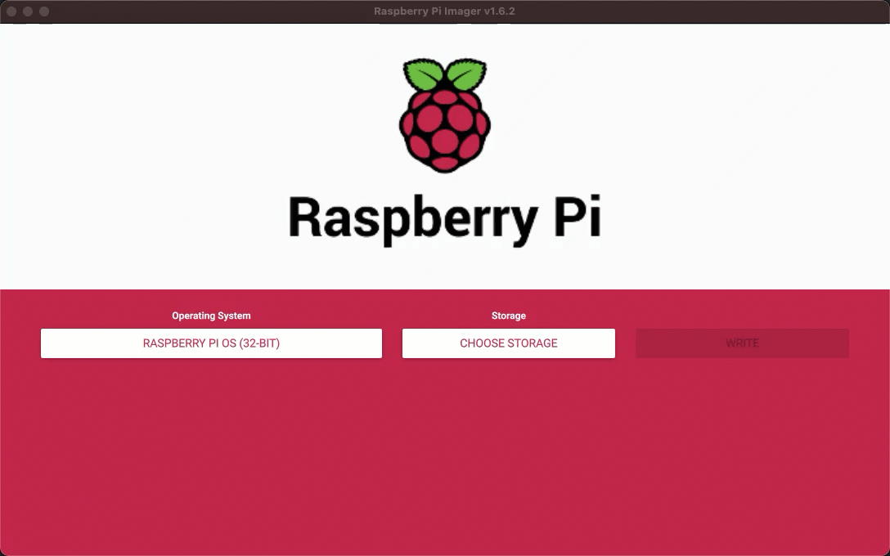
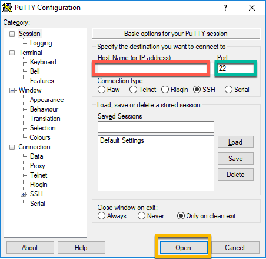
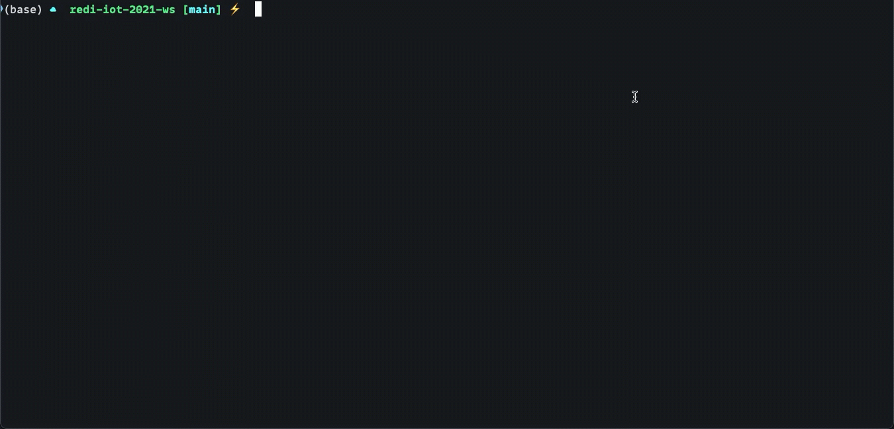
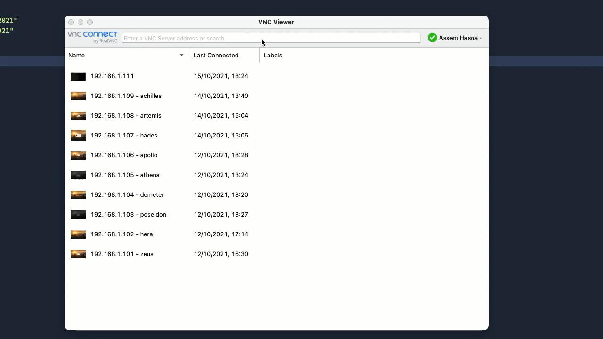
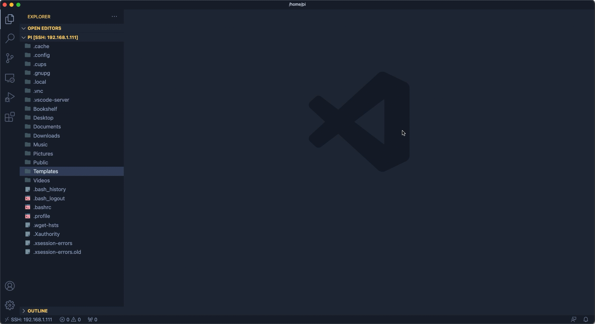

# Session #1 Hands-On Guide

## Configuring a new Raspberry Pi

The first step for configuring your Raspberry Pi is to flash an Operating System on an SD Card.

### Install OS

- Download and install the Raspberry Pi Imager software for your OS from [here](https://www.raspberrypi.com/software/)



- choose an OS (Raspberry Pi OS in this case)

- Choose the SD Card on which the OS will be flashed

- wait until the writing process finishes



### Initial Configuration

- after this is done you can insert the SD card in you RaspberryPi and plug it to power

- Raspberry Pi will boot up and you will see the following setup dialog:


### Connect to Raspberry Pi

#### SSH

Secure Shell (SSH) is the best and most secure way to remotely connect to a remote system's Command Line Interface (CLI).
More Info [here](https://en.wikipedia.org/wiki/Secure_Shell)

##### On Windows

- Download and Install [PUTTY](https://www.putty.org/)

- Enter your Raspberry Pi's username (default is `pi`)

- Enter your Raspberry Pi's password (default is `raspberry`)



##### Linux & MacOS

- open Terminal

- enter the following Command

```bash
$ ssh pi@192.168.1.111 # this IP will be different for you

The authenticity of host "192.168.1.111 (192.168.1.111)" cant be established.
ECDSA key fingerprint is SHA256:lCbCbKAGckR00bpbU4oP2ujU1c1SZJUGu/qNNGHWzec.
Are you sure you want to continue connecting (yes/no/[fingerprint])? yes
Warning: Permanently added '192.168.1.111' (ECDSA) to the list of known hosts.

pi@192.168.1.111 password:

Linux raspberrypi 5.10.17-v7+ #1414 SMP Fri Apr 30 13:18:35 BST 2021 armv7l

The programs included with the Debian GNU/Linux system are free software;
the exact distribution terms for each program are described in the
individual files in /usr/share/doc/*/copyright.

Debian GNU/Linux comes with ABSOLUTELY NO WARRANTY, to the extent
permitted by applicable law.
Last login: Fri Oct 15 18:23:56 2021
pi@raspberrypi:~ $
```



#### Command to try on the Raspberry Pi CLI

for more cool commands you check [this page](https://www.raspberrypi.com/documentation/computers/using_linux.html)

```bash
# List current folder content
$ ls -la
total 96
drwxr-xr-x 17 pi   pi   4096 Oct 15 18:23 .
drwxr-xr-x  3 root root 4096 May  7 16:42 ..
-rw-------  1 pi   pi     43 Oct 15 18:23 .bash_history
-rw-r--r--  1 pi   pi    220 May  7 16:42 .bash_logout
-rw-r--r--  1 pi   pi   3523 May  7 16:42 .bashrc
drwxr-xr-x  2 pi   pi   4096 May  7 16:52 Bookshelf
drwxr-xr-x  5 pi   pi   4096 Oct 15 18:12 .cache
drwx------  5 pi   pi   4096 Oct 15 18:22 .config
drwx------  2 pi   pi   4096 Oct 15 18:18 .cups
drwxr-xr-x  2 pi   pi   4096 May  7 17:07 Desktop
drwxr-xr-x  2 pi   pi   4096 May  7 17:07 Documents
drwxr-xr-x  2 pi   pi   4096 May  7 17:07 Downloads
drwx------  3 pi   pi   4096 May  7 17:07 .gnupg
drwxr-xr-x  3 pi   pi   4096 May  7 16:52 .local
drwxr-xr-x  2 pi   pi   4096 May  7 17:07 Music
drwxr-xr-x  2 pi   pi   4096 May  7 17:07 Pictures
-rw-r--r--  1 pi   pi    807 May  7 16:42 .profile
drwxr-xr-x  2 pi   pi   4096 May  7 17:07 Public
drwxr-xr-x  2 pi   pi   4096 May  7 17:07 Templates
drwxr-xr-x  2 pi   pi   4096 May  7 17:07 Videos
drwx------  3 pi   pi   4096 Oct 15 18:18 .vnc
-rw-------  1 pi   pi     56 Oct 15 18:23 .Xauthority
-rw-------  1 pi   pi   2426 Oct 15 18:24 .xsession-errors
-rw-------  1 pi   pi   2473 Oct 15 18:19 .xsession-errors.old

# go to Desktop folder
cd ~/Desktop

# get system Date and Time
$ date
Fri 15 Oct 2021 06:46:18 PM CEST

# get disk space

$ df -h
Filesystem      Size  Used Avail Use% Mounted on
/dev/root        14G  3.5G  9.9G  26% /
devtmpfs        430M     0  430M   0% /dev
tmpfs           463M     0  463M   0% /dev/shm
tmpfs           463M  6.3M  456M   2% /run
tmpfs           5.0M  4.0K  5.0M   1% /run/lock
tmpfs           463M     0  463M   0% /sys/fs/cgroup
/dev/mmcblk0p1  253M  1.2M  251M   1% /boot
tmpfs            93M  4.0K   93M   1% /run/user/1000
```

#### VNC

another way to connect to Raspberry Pi is using VNC which is a remote desktop protocol.

- Download and Install VNC Viewer [here](https://www.realvnc.com/en/connect/download/viewer/)
- Connect using the IP of your Raspberry Pi



### Programming on Raspberry Pi

#### Install VS Code

VS Code is a great IDE-Like text editor which allows you to connect to your raspberry pi and write and execute code directly on it

- Download and Install it [here](https://code.visualstudio.com/)

#### Install Remote SSH Plugin and Connect VS Code to RPi

- install Remote Development Plugins
- Using Remote Explorer, add new remote host to VS Code


#### Clone example project from GitHub

- after connecting to your Raspberry Pi using Remote Explorer in VS Code open a new terminal using *ctrl+`*  or from Menu Bar: Terminal > New Terminal
- clone `ahasna/redi-iot-2021-ws` repo by running:

```bash
cd ~
git clone https://github.com/ahasna/redi-iot-2021-ws.git
```

- navigate to the examples directory

```bash
cd ~/redi-iot-2021-ws/examples
```

- run the following python script

```bash
python3 hello_world.py
```

- try to update the code and play around



## Congratulations

you have finished your very first Raspberry Pi Mission. You can now proudly call yourself a Raspberry Pi Programmer 😎
