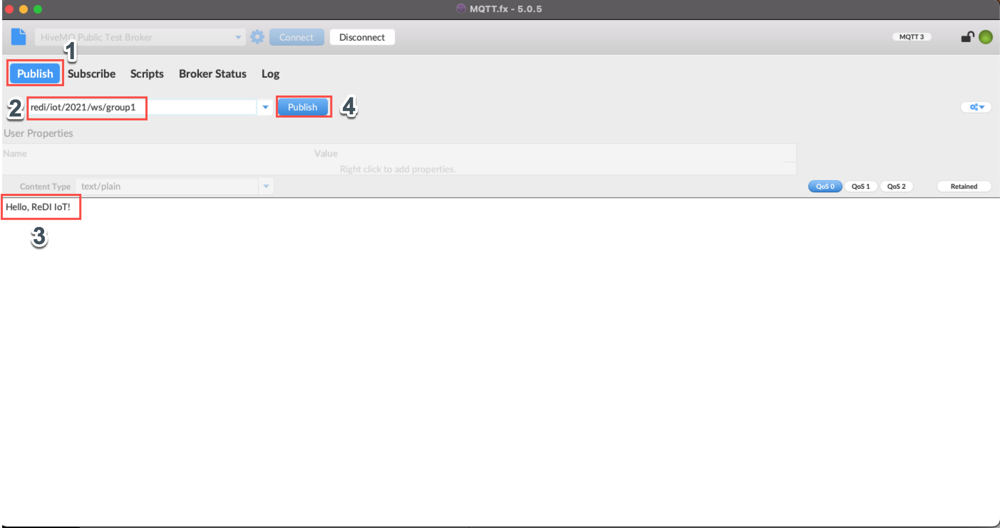

# Session #2 Hands-On Guide

## MQTT Fx

MQTT Fx is a visual MQTT Client which can be used to publish and subscribe to Public and Private Brokers. It can also be used for debugging and testing IoT Applications during development phase.

To use MQTT FX please follow these steps:

### Download & Install

Download & Install MQTT FX for your OS from [here](https://softblade.de/en/download-2/)


- After starting MQTT FX for the first time, you'll be prompted to activate it. Please use the Activation key below to activate a trial version of the software:

```text
-----BEGIN CERTIFICATE-----
MIIFnjCCA4YCCQDm7/FV5GARMzANBgkqhkiG9w0BAQ0FADCBqTELMAkGA1UEBhMC
REUxEDAOBgNVBAgMB0JhdmFyaWExETAPBgNVBAcMCEVybGFuZ2VuMRcwFQYDVQQK
DA5Tb2Z0YmxhZGUgR21iSDEZMBcGA1UECwwQd3d3LnNvZnRibGFkZS5kZTEcMBoG
A1UEAwwTU29mdGJsYWRlIFJvb3QgQ0EgMTEjMCEGCSqGSIb3DQEJARYUY29udGFj
dEBzb2Z0YmxhZGUuZGUwHhcNMjEwNzMxMTQ0NzU2WhcNMjExMTI4MTQ0NzU2WjB4
MQswCQYDVQQGEwJERTEMMAoGA1UECAwDTlJXMREwDwYDVQQHDAhFcmxhbmdlbjES
MBAGA1UECgwJU29mdGJsYWRlMRIwEAYDVQQDDAlTb2Z0YmxhZGUxIDAeBgkqhkiG
9w0BCQEWEW5pa29Ac29mdGJsYWRlLmRlMIICIjANBgkqhkiG9w0BAQEFAAOCAg8A
MIICCgKCAgEAqUE9p71j0zzCIQJlacOrA/k7EvNO98jdVUS77opS2ONUg6mwWZ8H
QJrJbce00xN8RPTPfKG4gmpWYY9JEIl9U4baYGAjMALiEaInxODZ8TF1IqyKdmyL
9Q7t+Fd+goGZy1rZUeLDxU40OXZ0okJu1vc5lrXkVDQtscPeEvB/HORsV9+9LM0v
hUIx+S+SmF0CCh/oNWlmIW5lL0kViD49YC8jaULLzEgljh4rV3rQwKp40MBmFJkt
E3eMa3vfjHwDTlsTY84gLhAY5gYPzlTJPCXFrMlmiSGc5/tl3TTyT1+TJAEP3pGJ
ktRbEmlQi5FwOaGgSfbUj+5Sq1t+ZLp0stmB2wYh0izN/zklTB9FJMN93o/dbqVm
TS4ygxiUD3wuxL/yQryMoSHkPgZQfEEd4fHc22eetCrBwJRgs4wP528WfZ/Kup8o
SpAXexJlptFfiLY00XzXNxDWfzwEKBbJ5JUnNRIvzZ2Pul1ZYZ+/FKjjLUG7hmBW
nkkmUcu3758bbCRccwqiIlLcQrzx48TnOkiIpEoIEPKpBFkwpURLYMyrMfK9CSFO
l28/xYqf7WNdywABCmqCIiQIyvoIHDvYF3HR3fcEJ/4kqAA+Zt0A6X3uK2Bvsr9h
LuwaZnKPC2r3ghvqKIvTzvztj7isL4RRTrkf/0hZ/Xg5MIxsZCsRZ3cCAwEAATAN
BgkqhkiG9w0BAQ0FAAOCAgEAcrqWfOWEjMte0XhDZ2A4IUePW4uxZFxJ+Y1QFyY5
TBh0Kn0vAM1KRTieM8BLYvLhIBBCcGm5k5UHUvxVoNwO2N50k+EcCJpSqImi34Il
vhKUBrVs1BIlZ4uhcvUnEcwZQwrNDEKpaW2NApkvfAy3Iha8FiyMm02gzRwCu87/
PivLlnNWjIY4wn9Tv4f62TTHCKcz7XQphzZW7v3euadHe4hyr0NfJC1qzykiVflV
mDae8vm8gI6GRYu9+fpx+xB2TL3TV6jNF4hUVy1dQNJ0BEJF5xNMY8MtQA56QfJT
IsX53SpvVDzjPNb5ZyDtuLdYGeX6fse4XbowX32ROzjPdGpf8FFFwKsXHBkLn/Nu
UTOXqIXmM3DWcSKJI2QH/83vRZxfwTvvyeBSO4UHw/Be+5JHbvWFZtj+X1NfO9Ss
fUwaXbMS8LfKttyIoTIQrFNSvIdQQFch17Fi1/RAzsPBhSTinTWQccRu2m9x8Xkz
Fl5igOqu3Y7MWXQMh34Vzq+4zLiJSCddFIQDLFN926qc5jvNfTbq0gSznsGrW4Ec
ILxeJiT85mF4NpDuv91q7S0n7fcrhuxrv/6S2WhnwpeAXbHKg/LInksKov2w2KQL
kCIoNft6bwbDof59I6BQEdkdBz/VtTP17XPHo4xn1xAF80jeu1UbcioiK0P05HGe
Vi0=
-----END CERTIFICATE-----
```


### Add and connect to a Public Test Broker (HiveMQ Public Broker)


### Subscribe to a topic


### Publish to a topic




